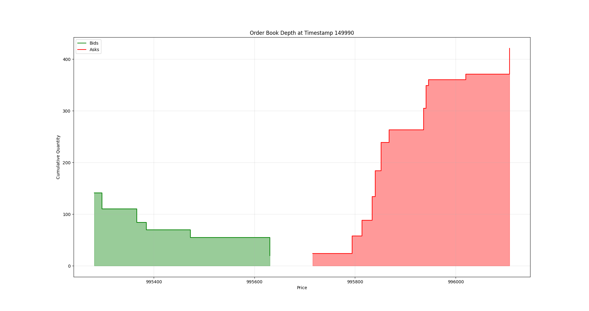
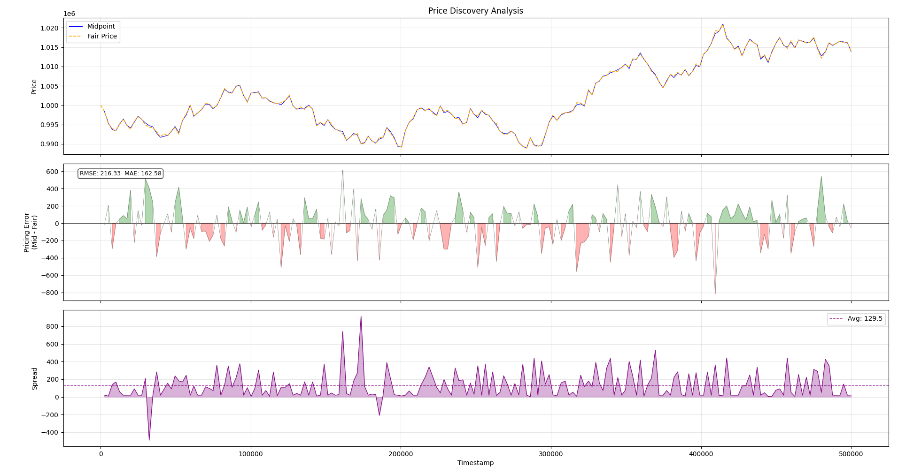

# Discrete Time Agent-based Market Simulator


Interactive CLI that can replay the order book from log files, step forward and back, seek to arbitrary timestamp, and list orders at desired levels.
```
> h
Commands:
  <timestamp>          - Jump to timestamp
  n                    - Next timestamp
  p                    - Previous timestamp
  o <order_id>         - Inspect specific order
  l <BUY|SELL> <price> - List orders at price level
  t                    - Inspect the top of the book
  d <num|max>          - Set number of levels to display
  q                    - Quit
  h                    - Print commands available

===============================================
 ORDER BOOK at timestamp 999621
===============================================
 Midpoint: 493306.5  Spread: 22611

     BID (Qty @ Price) | ASK (Qty @ Price)     
-----------------------+-----------------------
           23 @ 482001 | 2 @ 504612            
           50 @ 481848 |                       
           65 @ 481458 |                       
           69 @ 481271 |                       

[70211/70233] Timestamp: 999621
> 
```

The CLI allows the user to read the artifacts produced by the simulation, and explore tick by tick.

Visualization (very crude and basic):



This plot shows the cumulative quantity of orders in the order book at a specific timestamp.



This plot shows a sampled timeseries from the simulation, displaying the spread and the pricing errors over time.

Note that the simulation parameters have not been optimized to produce good results, the project is in a very early stage at this point. As a next step, I will try to replicate a Glosten-Milgrom style market maker and see if the simulation produces results predicted by their framework under their conditions and assumptions.

## Building and testing the project

As this project is still in its early stages, the build and use process is not very streamlined. To run everything, install the Python dependencies from the pyproject.toml file. There is a build and test script that uses either g++ or clang to build from the source, then run the unit and integration tests. (tip: pass the flag ``--debug`` to only build the project in debug, skip UB and ASAN, not really needed for basic usage).

All of the analysis tools are found in the `tools/` directory, passing -h for all of them will give usage instructions (same for the simulator).

The simulator can be configured using the JSON file, to make changes to the config, copy the template (config_template.json) and rename the copy to `config.json`, the simulator will use this as a default with a fallback to the template. There is also a usage.md file found in `docs/`

Requires a working g++/clang install, CMake, Python3, Pytest, GoogleTest 
