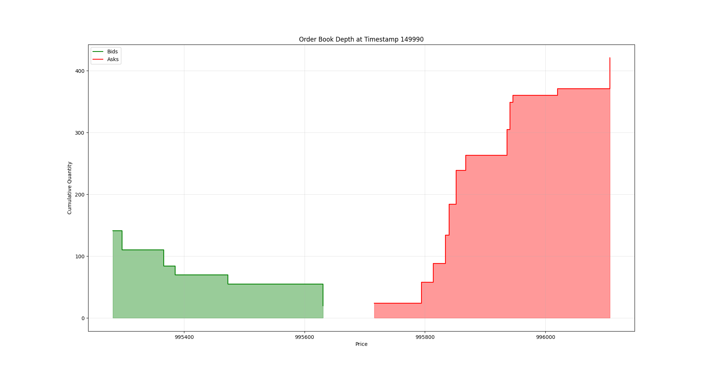
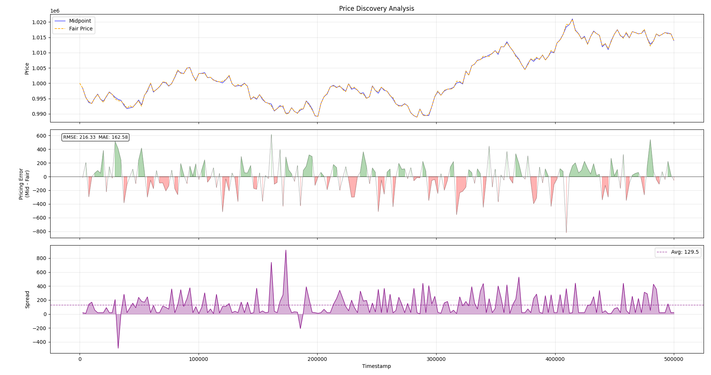

# Market Microstructure Simulator

A discrete-time, event-driven market microstructure simulation framework written in modern C++23. Designed for studying price discovery, adverse selection, and agent behaviour in an artificial limit order book market.

---

## Overview

The simulator models a continuous-time limit order book driven by heterogeneous trading agents. A matching engine processes order flow, agents react to fills and market state, and the resulting tick data is logged for post-hoc analysis with Python tools.

The core design priorities are correctness, reproducibility, and extensibility. Performance is secondary to clarity.

**Agent types:**

| Agent | Behaviour |
|-------|-----------|
| `NoiseTrader` | Submits random buy/sell orders, providing uninformed order flow |
| `MarketMaker` | Quotes both sides around fair price; adjusts quotes for inventory risk |
| `InformedTrader` | Trades directionally when estimated edge exceeds a configurable threshold |

**Fair price models:**

| Model | Description |
|-------|-------------|
| Geometric Brownian Motion | Standard diffusion with constant drift and volatility |
| Jump Diffusion (Merton) | GBM extended with a Poisson jump process for studying adverse selection under sudden price movements |

---

## Architecture

```
SimulationEngine (orchestrator)
├── Scheduler          priority queue of timestamped events
├── MatchingEngine     per-instrument order book and fill logic
├── FairPriceGenerator GBM or jump-diffusion price process
├── Agents             NoiseTrader, MarketMaker, InformedTrader
└── DataCollector      CSV output for all events
```

Events are dispatched via `std::visit` over a `std::variant` event type. Agents submit orders through an `AgentContext` interface and receive callbacks on fills, acceptances, rejections, and cancellations. The scheduler orders events by `(timestamp, sequence_number)` to resolve ties deterministically.

**Key design patterns:**
- Policy-based design for the matching engine (template parameters control matching behaviour)
- CRTP-based strong type system — all prices, quantities, IDs, and timestamps are distinct named types
- Visitor pattern for event dispatch
- Observer pattern for agent callbacks

---

## Technical Highlights

- **C++23** throughout, compiled with strict warnings treated as errors (`-Werror`)
- **Strong type system** — `Price`, `Quantity`, `OrderID`, `ClientID`, `Timestamp`, etc. are all distinct types with no implicit conversions; raw integers are never used in the simulation layer
- **Reproducibility** — every agent and the fair price process accept seeds; identical configs produce identical results
- **Log-normal latency jitter** — each agent's order-to-exchange latency is sampled from a log-normal distribution parameterised around a base latency, producing realistic latency variability
- **Cross-validation harness** — a Python replay engine independently reconstructs order book state from logged deltas and compares it against C++ exported state, catching any divergence between the two implementations
- **Three build variants** — debug, AddressSanitizer + UndefinedBehaviorSanitizer, and Valgrind

---

## Output and Analysis

The simulator writes structured CSV output for all events:

| File | Contents |
|------|----------|
| `deltas.csv` | Order book change events: ADD, FILL, CANCEL, MODIFY |
| `trades.csv` | All executed trades |
| `pnl.csv` | Periodic P&L snapshots per agent |
| `market_state.csv` | Fair price, best bid, best ask at each timestamp |
| `metadata.json` | Full simulation configuration |

### Order Book Visualizer

Reconstructs and navigates order book state at any timestamp by replaying delta events. Supports static snapshots, depth charts, and frame-by-frame animation exported to mp4 or gif.

```
> h
Commands:
  <timestamp>          - Jump to timestamp
  n                    - Next timestamp
  p                    - Previous timestamp
  o <order_id>         - Inspect specific order
  l <BUY|SELL> <price> - List orders at price level
  t                    - Inspect the top of the book
  d <num|max>          - Set number of levels to display
  q                    - Quit

===============================================
 ORDER BOOK at timestamp 999621
===============================================
 Midpoint: 493306.5  Spread: 22611

     BID (Qty @ Price) | ASK (Qty @ Price)
-----------------------+-----------------------
           23 @ 482001 | 2 @ 504612
           50 @ 481848 |
           65 @ 481458 |
           69 @ 481271 |

[70211/70233] Timestamp: 999621
>
```



### Timeseries Analysis

Plots spread, midpoint, fair price, and pricing error over time to evaluate price discovery quality.



### Adverse Selection Analysis

Measures how quote age at the time of fill correlates with adverse selection experienced by the market maker. Tests the stale-quote hypothesis: resting quotes that lag the fair price should suffer systematically worse outcomes.

```
Adverse Selection Analysis (MM client_id=999)
============================================================
Total MM fills: 23488 (maker only)
  vs InformedTrader: 2697 (11.5%)
  vs NoiseTrader: 20791 (88.5%)

By Quote Age:
  Bucket         | Count | Mean Imm. AS | Med Imm. AS |  Mean AS@200 | % Informed
  -------------------------------------------------------------------------------
  [0, 6)         |  5622 |          2.4 |         4.0 |         12.8 |       2.1%
  [6, 10)        |  5208 |        -13.0 |       -12.0 |         -3.4 |      15.0%
  [10, 15)       |  5977 |        -24.5 |       -25.0 |        -32.9 |      14.1%
  [15, inf)      |  6681 |        -30.8 |       -33.0 |        -27.2 |      14.4%
```

---

## Quick Start

**Requirements:** CMake 3.28+, g++15 or clang++-18, Python 3, pytest

```bash
# Install Python dependencies
pip install sortedcontainers matplotlib numpy pytest

# Build
cmake -S . -B build/debug && cmake --build build/debug --parallel 4

# Run simulation (uses config_template.json by default)
./build/debug/MarketSimulator

# Explore order book interactively
python tools/visualize_book.py output/deltas.csv -i

# Plot price discovery metrics
python tools/visualize_timeseries.py output/ --analysis

# Analyse adverse selection
python -m tools.analyze_adverse_selection output/ --plot

# Run all tests (debug + ASAN + Valgrind + Python)
./build.sh
```

To customise the simulation, copy `config_template.json` to `config.json` and edit it. The simulator will prefer `config.json` when present. See [docs/usage.md](docs/usage.md) for the full configuration reference.

---

## Testing

```bash
# Debug build and tests only (faster)
./build.sh --debug

# Run specific C++ test suite
./build/debug/unit_tests --gtest_filter="MatchingEngine*"

# Python tests
pytest tests/ -v

# Cross-validation (C++ vs Python order book reconstruction)
python -m tools.testing.harness --build-dir build/debug
```

The cross-validation harness runs C++ test scenarios with state export enabled, replays the delta logs in Python, and asserts that both implementations produce identical order book state at every checkpoint.

---

## Repository Structure

```
include/        C++ headers (main source)
  agents/       NoiseTrader, MarketMaker, InformedTrader
  exchange/     Order book types and matching engine
  simulation/   Engine, scheduler, events, fair price
  utils/        Strong type system
src/            C++ implementations
tests/          Google Test suites
tools/          Python analysis and visualisation
  visualizer/   Order book reconstruction library
  testing/      Cross-validation harness
docs/           Documentation and usage guides
config_template.json  Example configuration
```

---

## Documentation

Full usage documentation for all tools and configuration options is in [docs/usage.md](docs/usage.md).
